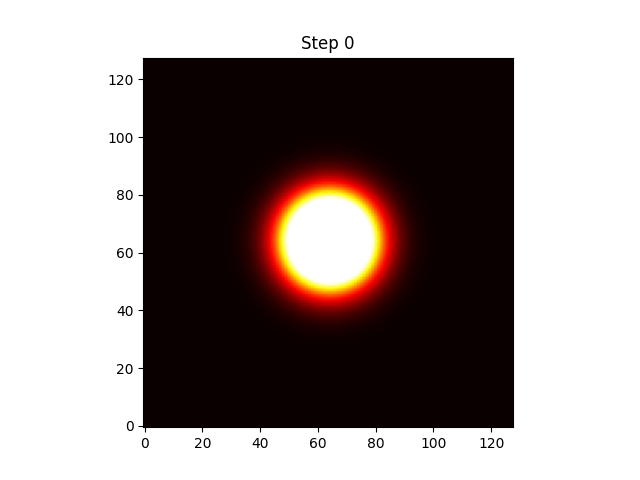

# Biconjugate-gradient-and-Gauss-Jacobi-implementation-on-multi-GPU-system
This repository contains implementation for Biconjugate gradient method and Jacobi method for implicit solution of PDE (heat equation). Both the solvers are for multi-GPU configuration and were run on NVIDIA A100s in rockfish cluster at Johns Hopkins University.

This project solves the **Laplace equation**:

∇²u = 0

in a 2D domain using the **BiCG and Jacobi iterative methods** with:

- **Neumann boundary conditions** (zero normal derivative),
- An **initial Gaussian heat spot** as the starting condition,
- Iterative updates until **convergence** (residual < `1e-6`) or a maximum number of iterations.

---
## 🌡️ Initial Condition

We use a **centered Gaussian** as the initial distribution:

u(x, y, t=0) = exp(-((x - x₀)² + (y - y₀)²) / (2σ²))

Where:
- `(x₀, y₀)` is the center of the domain,
- `σ` controls the spread of the heat spot.

---
## 🛠️ How to Run

```bash
nvcc -c -o 2gpu_bicg.o 2gpu_bicg.cu
mpicxx -o 2gpu_bicg 2gpu_bicg.o -I${CUDA_HOME}/include -L${CUDA_HOME}/lib64 -lcudart -lmpi -lpmix
```
---
## Results
For a matrix of size 128 x 128, the Gauss-Jacobi solver takes a time of 48.16 sec, whereas the bicg solver takes a time of 40.1 seconds. 


*Gauss-Jacobi method*

*Biconjugate gradient method*

---
## Visualization
Run animate_heat.py to generate the gif visualizing the evolution of u
